# SQL能力介绍
<!-- TOC -->

- [SQL能力介绍](#sql能力介绍)
  - [SQL基础能力概述](#sql基础能力概述)
  - [SQL处理流程概述](#sql处理流程概述)
  - [SQL优化器能力概述](#sql优化器能力概述)
    - [逻辑优化概述](#逻辑优化概述)
    - [CBO优化器](#cbo优化器)
    - [动态线程池管理](#动态线程池管理)

<!-- /TOC -->

## SQL基础能力概述

- 支持的SQL标准

    SQL语言是由美国国家标准化协会和国际标准化组织共同定义的一种标准化语言，行业中最主要的标准为SQL92和SQL99。SQL标准由十个部分组成，其中一部分（SQL/RPR:2012）是2012年新增的，另外五个部分在2011年进行了修订，其余四个部分仍然沿用2008年的版本。
    oGRAC数据库当前兼容**SQL:2003**的标准，对于后续的SQL:2006、SQL:2008、SQL:2011、 SQL:2016等一系列标准都实现了部分支持。主要不兼容的点如下：

    - 不支持`WHERE CURRENT OF`
    - 不支持`WITH HOLD`
    - 不支持`FOREIGN DATA WRAPPER`
    - 不支持`SECURITY LABEL`

- 支持的开发接口

    oGRAC提供业界标准的JDBC接口，保证用户业务快速迁移至oGRAC。
    目前支持标准的JDBC 4.0接口，JDBC支持通用的Linux和Windows平台。

- 支持的SQL语句
    在oGRAC中，对数据的所有操作都是通过SQL语句来执行的。SQL语句主要由标识符、参数、变量、名称、数据类型和SQL保留字组成。oGRAC支持的SQL语句类型可以分为数据库控制语句`DCL(Data Control Language)`、数据定义语句`DDL(Data Defination Language)`、数据操作语句`DML(Data Manipulation Language)`和数据查询语句`DQL(Data Query Language)`。
    - DCL: 用于设置或更改数据库事务、用户权限、锁表等。
    - DDL: 用于定义或修改数据库中的对象，如：表、目录、索引、视图、同名词、数据库、序列、用户、角色、表空间、会话等。
    - DML: 用于对数据库表中的数据进行操作，如：插入、更新、删除。
    - DQL: 用于查询数据库表中的数据。

- 支持函数及存储过程
    在oGRAC中，支持标准SQL中的函数和存储过程。存储过程是一组为了完成特定功能的SQL语句的集合，一般用于报表统计、数据迁移等。函数是对一些业务逻辑的内部封装，以完成特定的功能。函数执行完成后会返回执行结果。oGRAC当前支持的函数包含数值计算、时间日期、字符处理、聚集分析、类型转发、分组、间隔、表处理等。

## SQL处理流程概述
oGRAC中的SQL处理流程包括语法解析、查询重写、查询优化、创建执行计划和执行计划。根据语句的不同，数据库中可能会省略其中的某些步骤。如下图所示：

- SQL解析
  SQL处理的第一个阶段是SQL解析，当应用程序发出一条SQL语句时，数据库会发出解析调用，以准备该语句的执行。解析调用会打开一个或创建一个游标(`cursor`)，游标是用于会话私有SQL区域的一个句柄，保存着已解析的SQL语句及其他处理信息。在解析调用的过程中，数据库会执行语法检查和语义检查。
  - oGRAC支持SQL语句和匿名块(`PL/SQL`)Cache的功能，能够将用户输入的SQL语句或者匿名块(`PL/SQL`)与计划缓存中的副本进行比对，如果缓存中已经存在相同语句且不包含失效的数据库对象，则直接使用缓存中的计划，跳过计划生成的过程。
- SQL优化
  SQL优化又分为逻辑优化和物理优化，对应图中的查询重写优化和基于代价的查询路径优化。数据库会先基于静态的转换规则对抽象的语法树进行等价的变换，然后根据收集到的（或者估算的）实际访问数据的统计信息来计算不同的查询路径会产生的物理代价，选择一个代价最小的查询路径生成执行计划。
- SQL执行
  SQL执行阶段会根据优化器生成的执行计划进行迭代执行。在执行过程中，如果需要的数据不在当前的内存中，数据库会将数据从磁盘读取到内存中。数据库还会获取必要的锁以确保数据的完整性。处理SQL语句的最后阶段会关闭游标。
    - oGRAC支持使用`explain`语句查看当前语句的执行计划，可以直观地看到当前的执行计划中执行语句的先后顺序、连接方式和对应的过滤条件或连接条件

## SQL优化器能力概述

### 逻辑优化概述

SQL语法是灵活多样的，不同的人或工具写出来的SQL语句也是各式各样，因此发送给数据库的SQL语句往往会有一些冗余逻辑，很难达到最优的执行效率。逻辑优化的目的就是把用户输入的SQL语句改写为更高效的等价SQL。逻辑优化也叫查询重写，主要是应用一些启发式规则和关系代数理论，对满足特定场景的SQL进行改写。在查询重写的过程中遵循两个等价性和高效性两个基本原则。

当前oGRAC支持的一些关键的查询重写优化有：
- or转union
- 条件重组
- 排序消除
- 子查询消除
- in转exists
- 子查询转表
- 外连接消除
- 谓词下推
- 谓词传递
- 排序下推
- 分组聚集下推
- hash mtrl优化
- sort group优化
- cube group优化
- exists条件退化
- distinct 消除
- 投影列消除
- 子查询表消除
- connect by 下推
- connect by 物化优化
- any/all 变形
- rownum条件优化
- 子查询转窗口函数
- in list 结果集优化
- 半连接转内连接

### CBO优化器

在oGRAC中的优化器是典型的基于代价的优化（Cost-Based Optimization，简称CBO）。在这种优化器模型下，数据库根据表的元组数、字段宽度、NULL记录比率、distinct值、MCV值、HB值等表的特征值，以及一定的代价计算模型，计算出每一个执行步骤的不同执行方式的输出元组数和执行代价（cost），进而选出整体执行代价最小/首元组返回代价最小的执行方式进行执行。

CBO优化器能够在众多计划中依据代价选出最高效的执行计划，最大限度的满足客户业务要求。

当前oGRAC支持的一些主要的CBO模块的特性有：
- 基于动态规划的最小代价路径选择
- 支持选择索引扫描
- 支持选择率和代价估算
- 支持单列和多列谓词
- 支持index unique/range/full/fast/skip/only语法的扫描路径生成
- 支持distinct/group by/order by语法的计划路径生成
- 支持内连接、外连接、半反连接、全连接、左连接的多表join
- 支持生成nest loop连接方式的执行路径
- 支持生成hash join方式的执行路径
- 支持生成merge join的执行路径
- 支持分区表的代价估算
- 支持SQL HINT
- 支持OR场景的索引扫描
- 支持无统计信息下的索引扫描
- 支持`like/in/between and/is[not] null/true/false`语句的索引扫描

### 动态线程池管理

在OLTP领域中，数据库需要处理大量的客户端连接。因此，高并发场景的处理能力是数据库的重要能力之一。

对于外部连接最简单的处理模式是per-thread-per-connection模式，即来一个用户连接产生一个线程。这个模式好处是架构上处理简单，但是高并发下，由于线程太多，线程切换和数据库轻量级锁区域的冲突过大导致性能急剧下降，使得系统性能（吞吐量）严重下降，无法满足用户性能的SLA(Service-Level Agreement，服务等级协议)。

因此，需要通过线程资源池化复用的技术来解决该问题。线程池技术的整体设计思想是线程资源池化，并且在不同连接之间复用。系统在启动之后会根据当前核数或者用户配置启动固定一批数量的工作线程，一个工作线程会服务一到多个连接会话，这样把会话和线程进行了解耦。因为工作线程数是固定的，因此在高并发下不会导致线程的频繁切换，而由数据库层来进行会话的调度管理。

oGRAC中支持动态的线程池管理，能够根据当前的负载自动调整线程资源，无需DBA干预