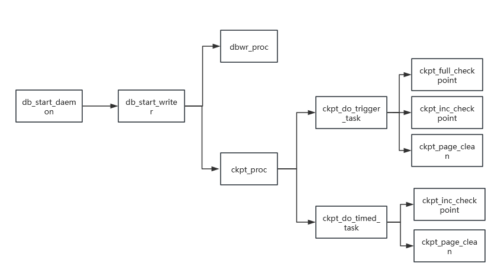

# 核心目标

为了平衡持久性和性能，数据库在数据的修改真正写入磁盘数据文件之前，先将这个修改操作记录到磁盘上的重做日志文件中，如果日志文件无限增长，恢复过程就需要重放从最开始到现在的所有日志记录，这可能会非常耗时。checkpoint（缩写为CKPT）就是为了解决这个问题而生的。CKPT是数据库管理系统中的一个关键机制，主要目的是在内存和磁盘之间建立一个同步点，以确保数据的一致性和持久性，并加速数据库的恢复过程。

# 工作机制

## 关键point

oGRAC有几个核心日志点，其基本结构都包含LFN（递增序号），用于标识log_batch顺序。

CURR_POINT：标记数据库最近一次落盘。

TRUNC_POINT：脏页落盘时，该点及该点之前的log都已落盘。

RCY_POINT：数据库恢复的起始点。

LRP_POINT：数据库至少恢复到该点才能保证数据一致。

在CKPT中进行log_flush时，会将LRP_POINT推到CURR_POINT，并将RCY_POINT推到最老的脏页的TRUNC_POINT，恢复时将从RCY_POINT开始重演日志

## CKPT工作线程

ckpt_proc为CKPT线程，负责处理CKPT请求，可主动触发也可定期/定量触发；

dbwr_proc为flush线程，负责刷脏页到数据盘；

ckpt_full_checkpoint用于全量CKPT；

ckpt_inc_checkpoint用于增量CKPT；

ckpt_page_clean用于writelist上的PAGE CLEAN

## 增量CKPT

当全量CKPT时，数据库需要将所有被修改过的数据页（脏页）一次性、全部写入磁盘。对于一个繁忙的数据库，脏页可能非常多。这种集中的、大量的磁盘 I/O 会瞬间占用大量系统资源，导致数据库在 CKPT 期间性能急剧下降，出现“卡顿”现象。这一带来的另一个问题就是CKPT不能频繁触发，导致point推进不及时，宕机恢复时间变长。增量 CKPT 就是为了解决这些问题而生的。

oGRAC增量 CKPT的核心思想是：不再一次性刷写所有脏页，而是通过一种机制，持续地、分批次地将脏页写入磁盘。这样，任何一个时间点需要持久化的脏页数量都大大减少，从而平滑了I/O写入，避免了性能尖峰。

## 批量并发刷脏页技术

传统的单页顺序刷新会带来显著的I/O开销和延迟。为优化性能，oGRAC引入批量与并发的刷新技术。将多个待写入的脏页在内存中组织成一个批次，然后由后台线程一次性、顺序地写入磁盘。此举将大量随机写I/O转化为高效的顺序写，极大地提升了I/O吞吐量。

为进一步降低延迟，oGRAC会启动多个刷新线程并发执行不同的刷脏批次，充分利用现代多核CPU和存储设备的并行处理能力。通过批量与并发的结合，数据库平滑了写入波动，避免了I/O性能尖峰，确保了在高负载下仍能保持稳定、高效的数据持久化能力。

# 相关参数配置

CHECKPOINT_PERIOD：两次增量CKPT之间的间隔时间

CHECKPOINT_PAGES：两次增量CKPT之间的脏页数

BUFFER_PAGE_CLEAN_PERIOD：两次PAGE_CLEAN之间的间隔时间

CHECKPOINT_GROUP_SIZE：一次增量CKPT最多处理的PAGE数

DBWR_PROCESSES: 刷脏页的线程个数

# 相关视图

## DV_DATABASE
- RCY_POINT: 恢复信息
- LRP_POINT: Least Recovery信息
- CKPT_ID: CHECKPOINT ID
- LSN: 重做日志序列号
- LFN: 重做日志刷新号
- LOG_FIRST: 重做日志开始文件号
- LOG_LAST: 重做日志结束文件号
- LOG_FREE_SIZE: 重做日志可用空间

## DV_SYS_STATS
- CKPT avg merge io: 脏页落盘平均IO合并数
- CKPT last merge io: 脏页落盘最后一次IO合并数
