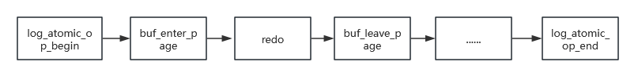

# 核心目标

数据库为了性能，所有数据修改都在内存缓冲区中进行。如果每次修改都直接写回磁盘，性能会极其低下。但如果一直不写回，一旦数据库崩溃，所有在内存中的修改都会丢失。重做（Redo）日志就是为了解决这个问题而生的。它的核心目标是：保证事务的持久性，即一旦事务提交，它对数据所做的修改就永久不会丢失，即使随后发生系统崩溃。

# 工作机制

## 日志原子操作

一个写操作在不同的页面记录了Redo/Undo，在记录间隙数据库发生掉电，在重新拉起回滚未提交的事务时找不到想要的日志，就会导致数据不一致。因此，oGRAC实现了日志的原子化操作，在一个原子操作内，要么都做，要么都不做，实现了Redo/Undo的原子落盘。

buffer_enter_page时会对页面添加排他锁，其他连接无法读写该页面，当buffer_leave_page时，页面锁会降级共享锁，此时其他连接可以读取该特面。只有当原子操作结束时，锁才会全部释放。

## 无锁化设计

多个会话在生成日志记录时，需要直接抢全局 buffer 的锁，每个日志记录追加时都可能争用。如果生成一条日志包含多次修改（比如一个事务的多个步骤），那么每条日志写入时都要抢锁，并发高时锁竞争激烈。

oGRAC在日志的原子操作开始时，会将日志写入session的私有buffer，原子操作结束时再从私有buffer拷贝到全局buffer，这在一定程度上减少了全局buffer锁争用。在拷贝到全局buffer时，多个session并发操作还是会导致锁争用降低性能。为解决这个问题，oGRAC提供了多log buffer机制，将全局buffer划分为多个part，通过哈希算法负载均衡拷贝操作。为了保证log有序，oGRAC在重启恢复时会对log重排序，这样可以提高数据库运行效率。

# REDO日志管理

## redo日志文件配置

### 增加redo日志文件
redo日志切换时会自动找到下一个，如果下一个redo处于active状态则无法切换，称作redo追尾。如果频繁出现redo追尾，会阻塞DML操作，需要增加redo文件。

可以在主机或者备机为redo log增加一个及以上的redo日志文件。只给出日志文件名，日志文件会添加到默认的路径下；
添加日志文件的时候，也可以设置绝对路径。

添加redo日志文件的命令如下：
ALTER DATABASE ADD LOGFILE
( { 'file_name' SIZE integer [ K | M | G | T | P | E ] 
 } [ , ... ] 
);

例如：ALTER DATABASE ADD LOGFILE ( 'testfile1' SIZE 2G BLOCKSIZE 1024);
      ALTER DATABASE ADD LOGFILE ( '/mnt/dbdata/local/ograc/tmp/data/testfile2' SIZE 2G BLOCKSIZE 1024);

### 删除redo日志文件

可以在主机或者备机为redo log删除redo日志文件，一次只能删除一个日志文件。直接使用文件名，则会自动补齐默认日志文件路径。

删除redo日志文件的命令如下：
ALTER DATABASE DROP LOGFILE ( 'file_name' );

例如：ALTER DATABASE DROP LOGFILE ( 'testfile1' );
      ALTER DATABASE DROP LOGFILE ( '/mnt/dbdata/local/ograc/tmp/data/testfile2' );

### 注意事项
- 创建删除REDO必须通过SQL命令删除，不允许直接操作REDO文件
- 数据库处于OPEN、允许读写状态下允许添加/删除REDO日志文件
- REDO日志文件数量限制最大256，最小3
- 添加/删除REDO期间会阻塞DDL操作，短暂暂停REDO刷盘可能阻塞DML，尽可能在业务低峰操作

