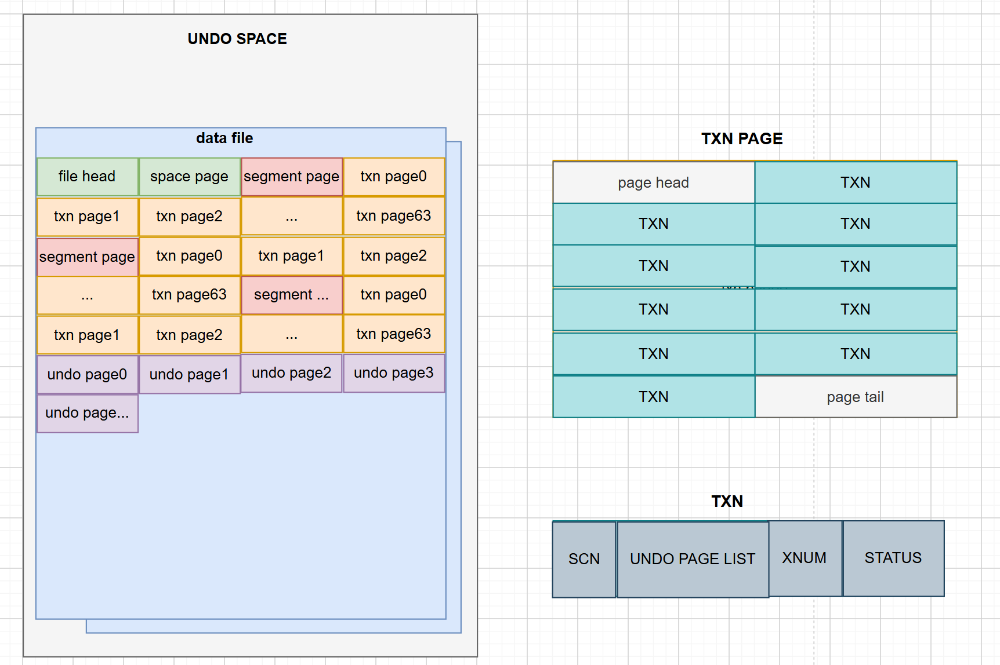
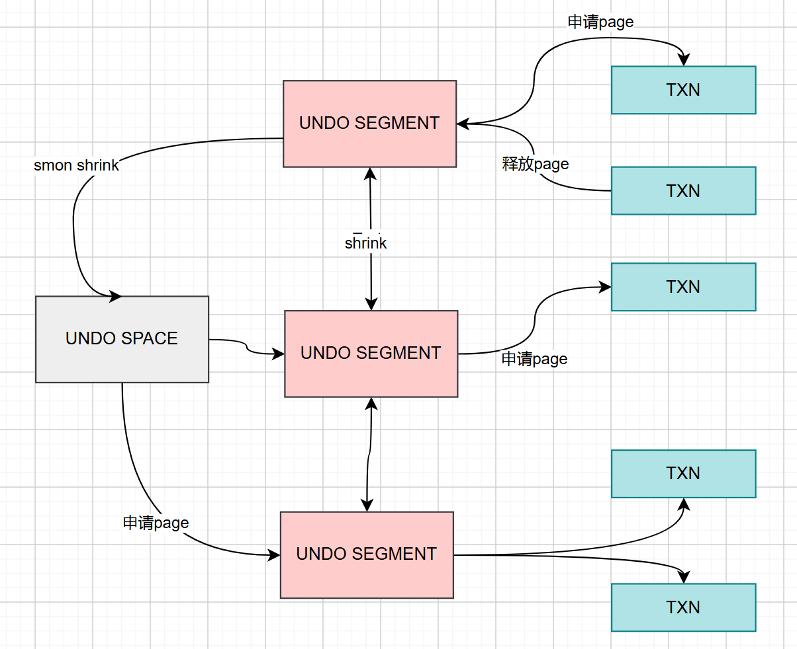
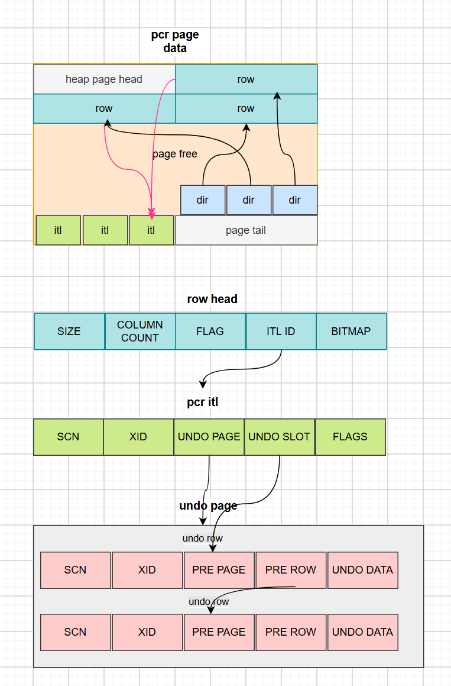
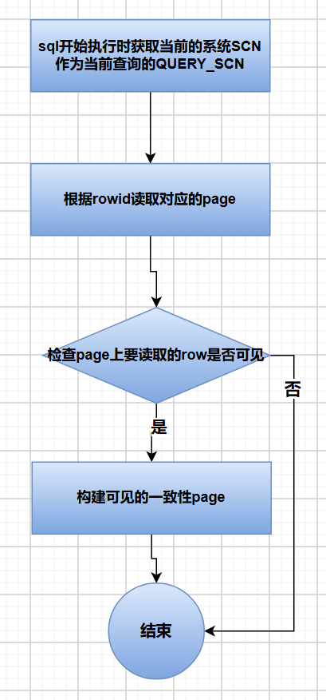
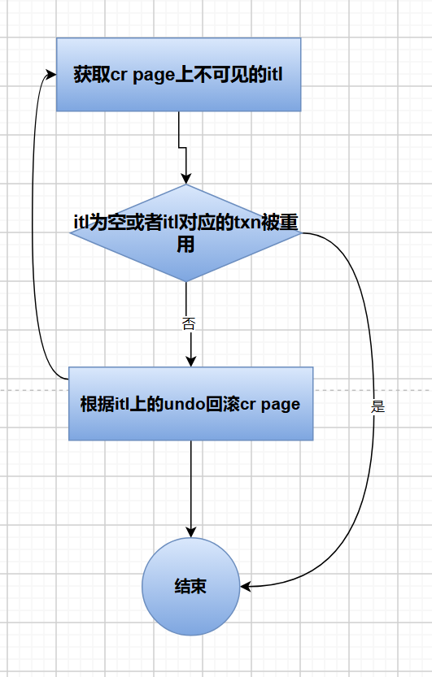
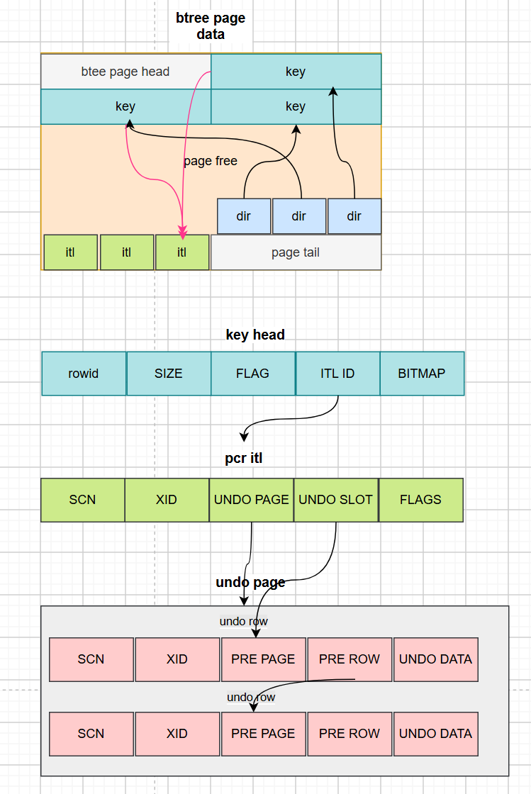

事务机制保证用户的操作的原子性，一致性，隔离性和持久性，即满足ACID要求。
通过以下技术实现ACID：
- Undo机制 记录用户每条记录的原始数据，回滚时可以用undo进行恢复，保证用户操作的原子性。
- Row Lock机制  通过行锁保证不会同时修改同一行记录。
- 可见性判断 通过比较查询者的SCN和记录的SCN来判断记录对于查询者是否可见。SCN(SYSTEM CHANGE NUMBER)，是一个64位的整数，它具有时间属性，由second+microsecond+sequence组成。当系统发生变更时，数据库的全局的SCN会递增。它作为可见性判断的主要标识。
- Redo机制 记录每个数据page的修改，写redo日志可以快速让数据持久化，同时事务提交时保证redo持久化到磁盘。

# 1. 事务管理
## 1.1 事务表
事务表是所有事务信息的集合。

事务表的存储结构如下：

开启事务时会占用一个TXN空间，TXN存放到TXN PAGE里，TXN page由undo segment管理，每个undo segment管理64个TXN page，undo segment缺省有32个，可以配置。undo segment信息存放到undo space里。undo space除了存放undo管理信息还存放undo page数据。undo page里存放undo row。

TXN由事务状态（标识事务提交与否），事务版本（TXN重用时区分不同的事务），SCN和undo page链表入口（存放undo数据）组成。

## 1.2 回滚段管理
当用户操作需要写undo时，需要到这个事务绑定的undo segment上申请undo page，如果undo segment没有可用的page，则需要到undo space上申请。当undo space上也没有空间则尝试从其他undo segment释放undo page。

如果设置了自动收缩undo segment选项，后台线程也会定期将有空闲undo page的segment释放一些page回undo space。

## 1.3 事务开启
ogRac是隐藏式启动事务，就是没有start transaction语句，是在用户调用调用修改类SQL时自动启动事务。

ogRac开启事务时会返回一个XID，这个XID由xmap和xnum组成，xmap相当于存放一个事务信息TXN的地址，xnum相当于是这个地址的重用版本号。

开启事务分配TXN时，先随机绑定一个undo segment，然后在这个undo segment上free txn链表里的选取一个TXN。
## 1.4 事务结束
ogRac在以下场景会结束事务：
1. 用户手动执行commit或者rollback来提交或者回滚自己开启的事务；
2. 用户执行DDL操作，会自动将当前会话没有结束的事务进行提交；
3. 客户端异常退出，服务端会把异常退出的会话没有结束的事务回滚；服务端故障重启时也会自动回滚没有结束的事务；
4. 客户端正常退出，根据客户端的缺省设置是自动提交事务。
结束事务时，ogRac会设置TXN上事务的SCN，事务的状态，会释放事务占用的undo page到undo segment，会通知等待它结束的其他事务，会释放锁资源，释放TXN事务资源，重置事务资源管理上下文。
## 1.5 Savepoint
SAVEPOINT（保存点） 是事务内的一个标记点，用于在事务执行过程中设置中间节点。通过保存点，可以在事务出错时，只回滚到指定的标记点，而不必放弃整个事务的所有操作，从而提高事务处理的灵活性。
设置savepoint时，ogRac在事务资源管理上下文上登记当前事务的undo row信息和使用的锁信息。执行回滚到save point操作时回滚undo到savepoint登记的undo row和释放锁从save point登记的锁开始。

# 2. 事务隔离级别
ogRac支持的事务隔离级别为读已提交和可串行化。
## 读已提交（Read Committed）
RC隔离级别保证事务访问其他事务修改数据时，只能读取已提交的数据版本。避免出现脏读，但存在不可重复读现象。
## 可串行化
此隔离级别下，事务之间完全隔离，保证了并发事务之间不会产生冲突，避免了脏读、不可重复读和幻读。

# 3. MVCC（多版本并发控制，Multi-Version Concurrency Control）
MVCC 的解决方案是：为数据维护多个版本，读操作访问历史版本，写操作修改当前版本，二者互不干扰，从而实现读写并行。
ogRac的MVCC 依赖两大核心组件协同工作：Undo 数据 和 SCN，通过版本数据和时间戳标记实现多版本访问。
ogRac通过MVCC实现了读已提交隔离级别和可串行化隔离级别。
## 3.1 HEAP MVCC

ogRac使用的是页面级的一致性读，就是先构建可见的页面再读取行数据。

页面里的dir记录对应row的offset页面位置。

事务在page上增删改时需要申请一个itl用于对这个page上的记录的管理和锁定，page上的一个itl可以管理同一个事务的多个row。

事务修改page上的row数据时写undo row，undo row记录修改之前的数据，用链表的方式串联起来。itl上登记最后的undo地址。row head上登记使用的itl id，每行row可以根据这个itl id找到对应的itl信息。
### 3.1.1 Heap fetch row 可见性判断流程
#### 3.1.1.1 Heap fetch根据rowid获取row时的可见性判断流程

1. sql开始执行时获取当前的系统SCN作为当前查询的QUERY_SCN。
2. 检查page上的row是否可见时，如果row head上的itlid非法，证明这行对应的itl已经被重用，对应的事务已经被提交，对应的SCN取当前页面上SCN作为该row之前事务的SCN，因为itl重用时会把之前的itl的SCN拷贝到page的SCN上。同样如果该row被加锁，没有修改又释放了锁也认为是之前的事务已经提交。
3. 如果itl合法，则校验itl的active状态，如果active状态时false则认为事务已经结束，如果active为true则需要查看TXN的事务状态，因为itl的active的更改是延迟实现的，即事务提交不立即修改。根据TXN里的xnum事务版本号和status事务状态判断TXN是否被重用，从而获事务适当的SCN和状态。
4. 如果事务没有提交同时不是自己则不可见；如果事务已经提交而且已经提交的事务的SCN小于QUERY_SCN则row可见，否则不可见。
5. 如果还是不可见，需要构建一致性读的page来获取可读的row记录。
#### 3.1.1.2 构建一致性读的page流程

1. 将当前的heap page拷贝一份到cr page上，cr page从cr page pool申请。
2. 获取page上的不可见itl时，如果itl对应的txn上的事务已经提交同时TXN已经被重用，需要报snopshot is too old错误；否则获取一个没有提交的itl或者SCN大于QUERY_SCN的itl；如果没有满足的itl直接返回cr page构造结束。选取已经提交的itl时，先选取SCN大的先回滚，防止事务间有依赖关系。
3. 如果itl对应的事务不在本节点则需要发到对应的节点取构建。
4. 回滚itl对应的undo row时，一直回滚到itl的undo为止。

##  3.2 BTREE MVCC

btree页面的mvcc的处理跟heap页面类似，但btree的itlid存放在key head上。