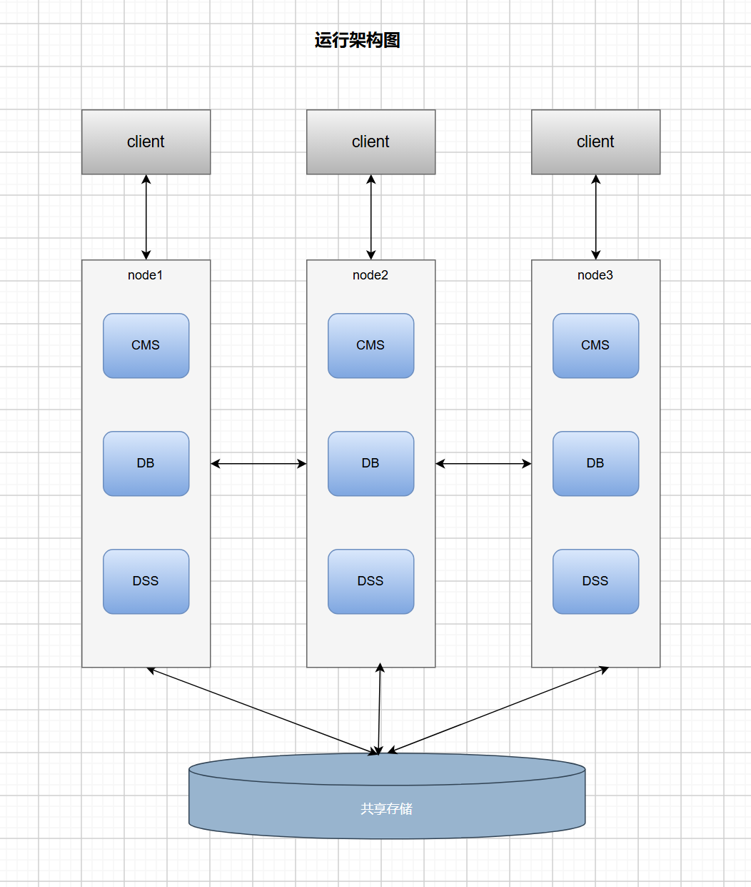
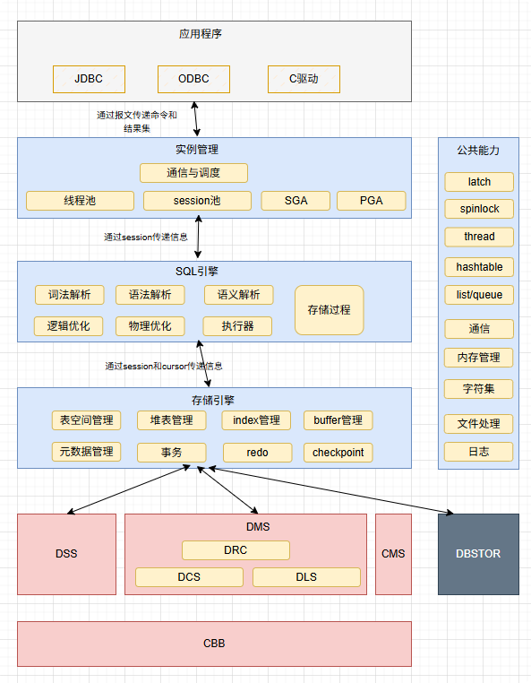

# 运行架构

- oGRAC是基于共享存储的集群架构。
- 由cms集群管理组件，DB数据库实例组件以及DSS开源集群文件系统组件组成。

# 逻辑架构

- 当前支持的驱动有jdbc驱动和c语言的ograc驱动，ODBC在研中，后续还会支持go和python驱动；
- oGRAC的实例管理模块包括通信管理和服务调度，线程池管理，session会话池管理以及全局内存管理SGA和私有内存管理PGA；
- sql引擎模块：支持词法解析，语法解析，语义解析，逻辑优化，物理优化，执行器以及存储过程；
- 存储引擎模块：表空间管理，堆表（heap）管理，索引管理，page buffer缓存管理，DC元数据管理，事务管理，redo管理，checkpoint
- DSS模块是基于LUN的高性能的共享集群文件系统；
- DBSTOR模块是基于华为dorado存储系统的给oGRAC专用的存储系统，它提供page pool和redo log接口；
- DMS是多写共享集群服务，提供DRC 分布式资源管理,DLS分布式锁服务,DCS分布式缓存服务能力；
- CMS是集群管理组件
- CBB模块是供DSS和DMS用的基础能力库，包括通信，数据结构，安全，文件等；