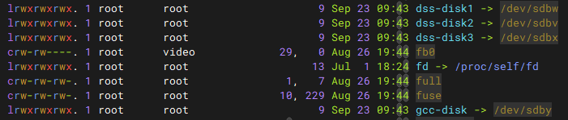
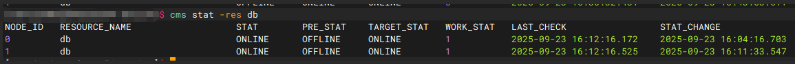

# oGRAC两节点安装

本文旨在介绍如何在物理机上进行`oGRAC`的两节点安装部署。

## 安装前须知

### 硬件要求

- 主机数量：2台
- 推荐主机硬件最低规格：
    - 内存：8GB
    - CPU：4核（16位）
    - 磁盘空闲空间：100GB
- ARM架构主机编译生成ARM包，X86架构主机编译生成X86包

---

## 安装准备

### 操作系统要求

- 支持的操作系统：
    - CentOS 8.2（7.x版本需要升级gcc）
    - openEuler 20.03/22.03 LTS（x86_64/arrch64）
- 建议使用上述版本的操作系统进行编译和部署

---

## 安装 oGRAC

### 1. 环境准备

#### 1.1 系统初始化

关闭 SELinux 和防火墙：

```shell
setenforce 0
sed -i 's/^SELINUX=.*/SELINUX=disabled/' /etc/selinux/config
systemctl stop firewalld
systemctl disable firewalld
```

#### 1.2 创建用户

- 两节点均需创建用户，并设置密码，两节点操作一致。

```shell
useradd ogdba
passwd ogdba  # 然后回显需要输入设置密码
```

#### 1.3 安装必要依赖

```shell
yum install -y wget python3 python3-devel iputils iproute --skip-broken
```

---

### 2. 获取安装包并传输到各个安装节点

- 可以在[openGauss官网](https://docs.opengauss.org/zh/)的`下载`页面进行安装包的下载获取。

```shell
假如安装包放在节点一的/data/ogdba目录下，则需要执行下面这个命令给节点二也传输一份

scp ogdba[ip2]:/data/ogdba [package_name]
```

>说明：
>
> - 避免将安装包放在/home/ogdba目录下，防止安装报错。

---

### 3. 两节点安装准备

> 请提前准备好 4 个 LUN，并在磁阵上划分好后挂载到主机。
>
>说明：
>
> - DeviceManager是在有了存储设备后自行配置的一个用于管理存储设备的网页。
> - 在第一次扫描、查询盘符时，如果查找不到，则可以使用iscsiadm -m node --logoutall=all 和iscsiadm -m node -p ip -l来断开连接并重新登录连接，注意该操作会影响所有连接的存储设备，可能会影响其他用户，请谨慎操作。这里的ip是存储设备的ip地址，可以使用iscsiadm -m node来查询。

通过如下步骤来进行LUN的划分：
1. 登录集群DeviceManager，选择`服务`->`LUN组`->`LUN`->`创建`来创建四个LUN，分为一个5G、一个4T、两个2T大小；(具体的大小请根据业务需求进行设置)
2. 将创建好的四个LUN添加映射到对应的主机组中即可；

#### 3.1 前期准备：解压文件并时间同步

节点1操作如下：
```shell
cd /data/ogdba
tar -zxvf [package_name]
chmod 777 ograc_connector -R; chown root:root ograc_connector -R
cd ograc_connector/action
ntpdate -u [ip2]  # 同步机器时间
date   # 检查两台机器时间是否同步，否则 CMS 无法启动
```
节点2操作如下：
```shell
cd /data/ogdba
tar -zxvf [package_name]
chmod 777 ograc_connector -R; chown root:root ograc_connector -R
```

#### 3.2 LUN 软链接建立（两节点均需执行，盘符以 by-id 为准）

节点1、2操作如下：
```shell
ln -s /dev/sdxx /dev/dss-disk1
ln -s /dev/sdxx /dev/dss-disk2
ln -s /dev/sdxx /dev/dss-disk3
ln -s /dev/sdxx /dev/gcc-disk
```
示意图如下：



建立软链接的对应关系如下表：

| 软链接 | 使用类型 | dss卷名 |  大小  |
|--------|--------|---------|---------|
| gcc-disk | gcc使用 |dsscmd查不到，不管理| 5G|
| dss-disk1| page   |vg1    |    2T   |
| dss-disk2| redo   |vg2    |    4T   |
| dss-disk3| 归档   |vg3    |    2T   |

#### 3.3 配置文件修改

- 进入 action 目录：

```shell
cd /oGRAC/pkg/deploy/action
```

- 编辑 `config_params_lun.json`，注意节点参数差异：

节点1上的`config_params_lun.json`进行如下修改配置：
```json
{
   "deploy_mode": "dss",
   "deploy_user": "ogdba:ogdba",
   "node_id": "0",
   "cms_ip": "xx.xx.xx.1;xx.xx.xx.2",
   "db_type": "1",
   "mes_ssl_switch": false,
   "MAX_ARCH_FILES_SIZE": "300G",
   "redo_num": "6",                 //请根据业务需要进行设置
   "redo_size": "5G"                //请根据业务需要进行设置
}
```

节点2上的`config_params_lun.json`进行如下修改配置：
```json
{
   "deploy_mode": "dss",
   "deploy_user": "ogdba:ogdba",
   "node_id": "1",
   "cms_ip": "xx.xx.xx.1;xx.xx.xx.2",
   "db_type": "1",
   "mes_ssl_switch": false,
   "MAX_ARCH_FILES_SIZE": "300G",
   "redo_num": "6",                 //请根据业务需要进行设置
   "redo_size": "5G"                //请根据业务需要进行设置
}
```


---

### 4. 节点安装与启动

节点1、2操作如下：
```shell
sh appctl.sh install config_params_lun.json
sh appctl.sh start
```

---

### 5. 查询集群状态

```shell
su -s /bin/bash ogdba
cms stat -res db
```
示意图如下：



## 卸载 oGRAC

停止服务并删除数据、安装目录及相关环境变量。

```shell
sh local_install.sh clean -u ogdba
```
