oGRAC 分区表管理

# 背景信息

分区表是将一张大表在物理上按规则（如日期、地域）分割成多个小表的技术。逻辑上仍是一张表，但对用户透明。核心优点是大幅提升查询性能（数据库只扫描相关分区，称为分区修剪），并简化数据管理（可快速归档、备份单独分区）。常用于处理海量历史数据，实现高效查询和维护。

oGRAC分区表提供四种分区策略，分别应对不同使用场景。

-   哈希分区：哈希分区是对分区键（例如一个ID列）应用一个哈希函数，根据计算出的哈希值将数据行随机且均匀地分布到各个分区中。常用于消除热点，实现IO负载均衡，适用于等值查询
-   范围分区：范围分区是根据分区键的连续值范围（如日期、数字序列）来划分数据的。每个分区包含特定范围内的数据。尤其适用于数据具有自然、连续且与业务查询模式高度相关的维度。
-   列表分区：列表分区是一种非常直观和实用的分区策略，根据分区键的离散值（如类别、状态、地区代码）来明确指定数据行归属到哪个分区。每个分区包含一个预定义的、不连续的值的集合。最适合数据可以根据某个列的几个明确的、不连续的值进行逻辑分组的场景。
-   间隔分区：间隔分区是范围分区的一种延伸。你只需要定义一个初始的分区范围和一个固定的时间间隔，数据库会自动在需要时创建新的分区。间隔分区完美适用于所有需要自动化、免维护地管理时间序列数据的场景。

# 分区表管理

## 创建分区表

### 语法描述

分区表的创建和普通表创建语法相似，在table_properties添加了PartitionOpt子句：

**PartitionOpt:**

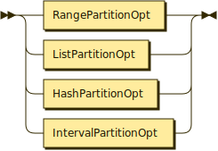

```
PartitionOpt
         ::= RangePartitionOpt
           | ListPartitionOpt
           | HashPartitionOpt
           | IntervalPartitionOpt
```

**RangePartitionOpt:**


```
RangePartitionOpt
         ::= 'PARTITION' 'BY' 'RANGE' '(' PartitionKey ( ',' PartitionKey )* ')' '(' RangePartitionItem ( ',' RangePartitionItem )* ')'
```

referenced by:

* PartitionOpt

**RangePartitionItem:**

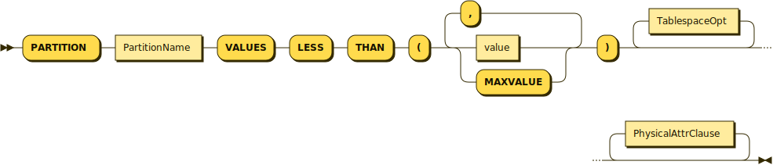

```
RangePartitionItem
         ::= 'PARTITION' PartitionName 'VALUES' 'LESS' 'THAN' '(' ( value | 'MAXVALUE' ) ( ',' ( value | 'MAXVALUE' ) )* ')' TablespaceOpt* PhysicalAttrClause*
```

referenced by:

* IntervalPartitionOpt
* RangePartitionOpt

**ListPartitionOpt:**


```
ListPartitionOpt
         ::= 'PARTITION' 'BY' 'LIST' '(' PartitionKey ( ',' PartitionKey )* ')' '(' ListPartitionItem ( ',' ListPartitionItem )* ')'
```

referenced by:

* PartitionOpt

**ListPartitionItem:**

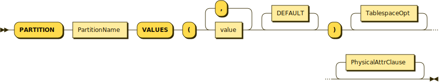

```
ListPartitionItem
         ::= 'PARTITION' PartitionName 'VALUES' '(' value ( ',' value )* DEFAULT* ')' TablespaceOpt* PhysicalAttrClause*
```

referenced by:

* ListPartitionOpt

**HashPartitionOpt:**

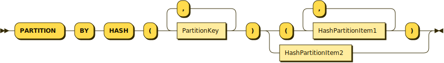

```
HashPartitionOpt
         ::= 'PARTITION' 'BY' 'HASH' '(' PartitionKey ( ',' PartitionKey )* ')' ( '(' HashPartitionItem1 ( ',' HashPartitionItem1 )* ')' | HashPartitionItem2 )
```

referenced by:

* PartitionOpt

**HashPartitionItem1:**


```
HashPartitionItem1
         ::= 'PARTITION' PartitionName TablespaceOpt* PhysicalAttrClause*
```

referenced by:

* HashPartitionOpt

**HashPartitionItem2:**

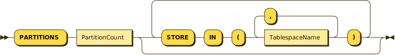

```
HashPartitionItem2
         ::= 'PARTITIONS' PartitionCount ( 'STORE' 'IN' '(' TablespaceName ( ',' TablespaceName )* ')' )*
```

referenced by:

* HashPartitionOpt

**IntervalPartitionOpt:**

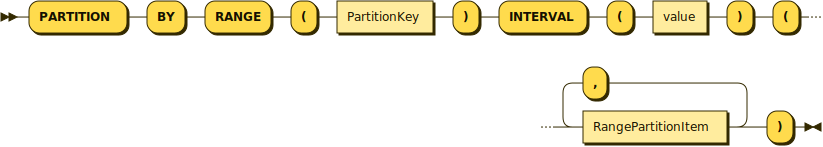

```
IntervalPartitionOpt
         ::= 'PARTITION' 'BY' 'RANGE' '(' PartitionKey ')' 'INTERVAL' '(' value ')' '(' RangePartitionItem ( ',' RangePartitionItem )* ')'
```

referenced by:

* PartitionOpt

**TablespaceOpt:**


```
TablespaceOpt
         ::= 'TABLESPACE' TablespaceName
```

referenced by:

* HashPartitionItem1
* ListPartitionItem
* RangePartitionItem

**PartitionKey:**


```
PartitionKey
         ::= Column
```

referenced by:

* HashPartitionOpt
* IntervalPartitionOpt
* ListPartitionOpt
* RangePartitionOpt

### 示例
```SQL
-- 范围分区

CREATE TABLE sales_range (
sale_id NUMBER,
sale_date DATE,
amount NUMBER,
region VARCHAR2(50)
)
PARTITION BY RANGE (sale_date) (
PARTITION sales_q1 VALUES LESS THAN (TO_DATE('2024-04-01', 'YYYY-MM-DD')),
PARTITION sales_q2 VALUES LESS THAN (TO_DATE('2024-07-01', 'YYYY-MM-DD')),
PARTITION sales_q3 VALUES LESS THAN (TO_DATE('2024-10-01', 'YYYY-MM-DD')),
PARTITION sales_q4 VALUES LESS THAN (MAXVALUE)
);

-- 列表分区

CREATE TABLE employees_list (
emp_id NUMBER,
emp_name VARCHAR2(100),
department VARCHAR2(50),
salary NUMBER
)
PARTITION BY LIST (department) (
PARTITION dept_sales VALUES ('SALES', 'MARKETING'),
PARTITION dept_tech VALUES ('IT', 'ENGINEERING'),
PARTITION dept_hr VALUES ('HR', 'ADMIN'),
PARTITION dept_other VALUES (DEFAULT)
);

-- 哈希分区方式1：指定分区名称

CREATE TABLE products_hash (
product_id NUMBER,
product_name VARCHAR2(200),
category VARCHAR2(100)
)
PARTITION BY HASH (product_id) (
PARTITION p1,
PARTITION p2,
PARTITION p3,
PARTITION p4
);

-- 哈希分区方式2：指定分区数量

CREATE TABLE orders_hash (
order_id NUMBER,
order_date DATE,
customer_id NUMBER
)
PARTITION BY HASH (order_id)
PARTITIONS 8;

-- 间隔分区
CREATE TABLE sales_interval (
sale_id NUMBER,
sale_date DATE,
amount NUMBER,
region VARCHAR2(50)
)
PARTITION BY RANGE (sale_date)
INTERVAL (NUMTOYMINTERVAL(1, 'MONTH'))
(
PARTITION sales_historical VALUES LESS THAN (TO_DATE('2024-01-01', 'YYYY-MM-DD')),
PARTITION sales_jan_2024 VALUES LESS THAN (TO_DATE('2024-02-01', 'YYYY-MM-DD'))
);
```
## 删除分区表

### 语法描述

分区表的删除和普通表删除语法相同

```BNF
DropTableStmt ::=
    'DROP' 'TABLE' ( 'IF' 'EXISTS' )* TableName ( ',' TableName )* ( 'CASCADE' | 'RESTRICT' )* 'PURGE'*

TableName ::=
    (schema.)*table_name
```

### 示例

```SQL
DROP TABLE sales_range ;
```

## 分区管理

### 语法描述

**AlterTableStmt:**

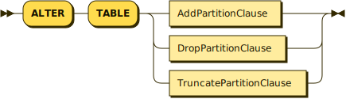

```
AlterTableStmt
         ::= 'ALTER' 'TABLE' ( AddPartitionClause | DropPartitionClause | TruncatePartitionClause )
```

**AddPartitionClause:**

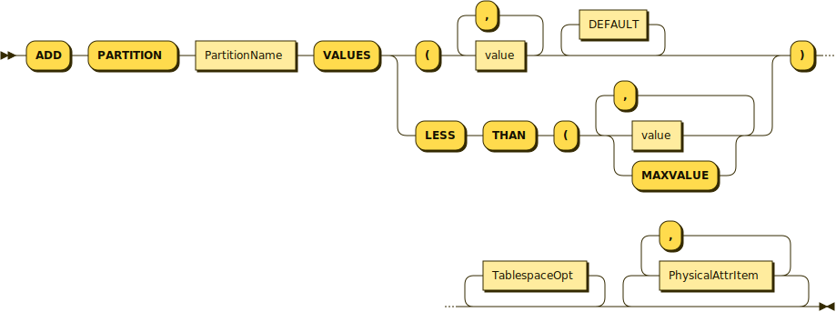

```
AddPartitionClause
         ::= 'ADD' 'PARTITION' PartitionName 'VALUES' ( 'LESS' 'THAN' '(' ( value | 'MAXVALUE' ) ( ',' ( value | 'MAXVALUE' ) )* | '(' value ( ',' value )* DEFAULT* ) ')' TablespaceOpt* ( PhysicalAttrItem ( ',' PhysicalAttrItem )* )*
```

referenced by:

* AlterTableStmt

**TableName:**

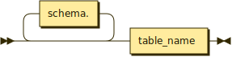

```
TableName
         ::= schema.* table_name
```

**TablespaceOpt:**


```
TablespaceOpt
         ::= 'TABLESPACE' TablespaceName
```

referenced by:

* AddPartitionClause

**PhysicalAttrItem:**

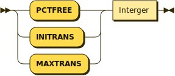

```
PhysicalAttrItem
         ::= ( 'PCTFREE' | 'INITRANS' | 'MAXTRANS' ) Interger
```

referenced by:

* AddPartitionClause

**DropPartitionClause:**


```
DropPartitionClause
         ::= 'DROP' 'PARTITION' PartitionName
```

referenced by:

* AlterTableStmt

**TruncatePartitionClause:**


```
TruncatePartitionClause
         ::= 'TRUNCATE' 'PARTITION' PartitionName TruncatePartitionStorage* 'STORAGE'
```

referenced by:

* AlterTableStmt

**TruncatePartitionStorage:**

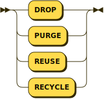

```
TruncatePartitionStorage
         ::= 'DROP'
           | 'PURGE'
           | 'REUSE'
           | 'RECYCLE'
```

referenced by:

* TruncatePartitionClause

### 示例
```SQL
-- 删除分区（如果存在空分区或已备份）

ALTER TABLE sales_range DROP PARTITION sales_q4;

-- 添加新的分区

ALTER TABLE sales_range ADD PARTITION sales_q1_2025
VALUES LESS THAN (TO_DATE('2025-04-01', 'YYYY-MM-DD'));

-- 清空分区数据

ALTER TABLE sales_range TRUNCATE PARTITION sales_q2;
```

## 查询分区

### 语法描述

分区表查询和普通表查询相似，需要添加PartitionClause子句：

```BNF
PartitionClause ::=
    'PARTITION'
    ( '(' PartitionName ')'
|   'FOR' '(' PartitionValue ( ',' PartitionValue )* ')')
```

### 示例
```SQL
--查询指定分区

SELECT * FROM sales_range PARTITION (sales_q1);

--查询指定分区键值的分区

SELECT * FROM sales_range PARTITION FOR (TO_DATE('2024-04-01', 'YYYY-MM-DD'));
```

# 分区索引管理

## 创建分区索引

### 语法描述

```BNF
PartitionIndexClause ::=
    ( 'LOCAL' '(' 'PARTITION' PartitionName (  ',' 'PARTITION' PartitionName )* ')' )*
```

### 示例
```SQL
--创建GLOBAL索引

CREATE INDEX sales_global_idx ON sales_range(sale_id) ;

--创建LOCAL索引

CREATE INDEX sales_local_idx ON sales_range(region) LOCAL;
```

## 删除分区索引

### 语法描述
### 示例
```SQL
--创建GLOBAL索引

DROP INDEX sales_global_idx ON sales_range ;
```
